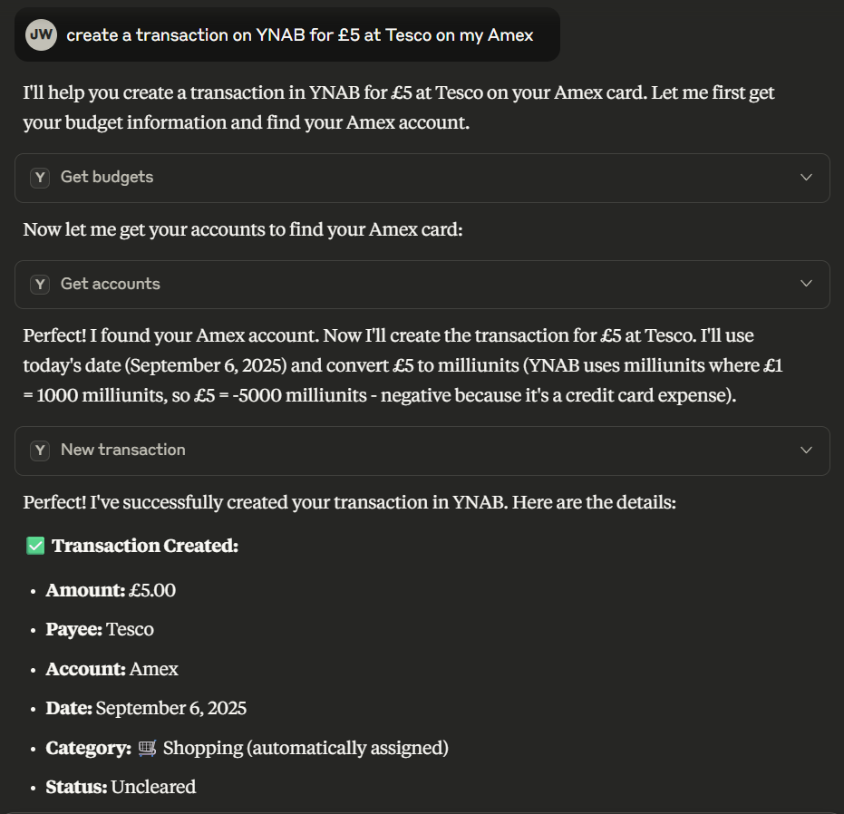
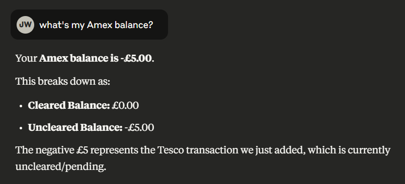
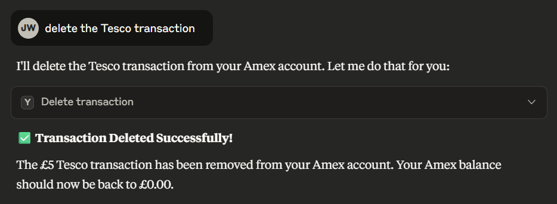

# YNAB MCP

## Contents

- [About](#about)
- [Screenshots](#screenshots)
- [Supported Operations](#supported-operations)
- [Installation Instructions](#installation-instructions)
  - [Prerequisites](#prerequisites)
  - [Setup](#setup)
    - [1. Configure YNAB API Token](#1-configure-ynab-api-token)
    - [2. Clone the Repository](#2-clone-the-repository)
    - [3. Build](#3-build)
  - [Claude Setup](#claude-setup)
    - [1. Open the MCP config](#1-open-the-mcp-config)
    - [2. Add entry for YNAB](#2-add-entry-for-ynab)

## About 

YNAB MCP is a Model Context Protocol (MCP) server that provides AI assistants access to the YNAB API. 

## Installation

These instructions are for the Anthropic Claud Desktop application. This should work with other MCP clients too.

### 1. Open the MCP config

#### Windows

```bash
code $env:AppData\Claude\claude_desktop_config.json
```

#### Linux / MacOS

```bash
code ~/Library/Application\ Support/Claude/claude_desktop_config.json
```

### 2. Add entry for YNAB

Substitute &lt;my token&gt; for your YNAB Personal Access Token

```json
{
  "mcpServers": {
    "ynab": {
      "command": "docker",
      "args": [
        "run",
        "-i",
        "--rm",
        "-e",
        "YNAB_API_TOKEN=<my token>",
        "ghcr.io/josephwalden13/ynab-mcp"
      ]
    }
  }
}
```

#### 3. Restart Claud

## Screenshots





## Supported Operations

#### General

- Read Budget & User info

#### Transactions

- Create
- Read
- Update
- Delete

#### Categories

- Read
- Update (Targets & Budgeted)

#### Payees

- Read

#### Accounts

- Read

## Build Instructions

### Prerequisites

- Docker
- YNAB Personal Access Token

### Setup

#### 1. Configure YNAB API Token

You need to obtain a Personal Access Token from YNAB:
1. Go to [YNAB Developer Settings](https://app.ynab.com/settings/developer)
2. Click "New Token"
3. Copy your Personal Access Token to the environment variable 'YNAB_API_TOKEN'

#### 2. Clone the Repository

```bash
git clone https://github.com/josephwalden13/YNAB-MCP.git
cd YNAB-MCP
```

#### 3. Build

```bash
docker compose up
```